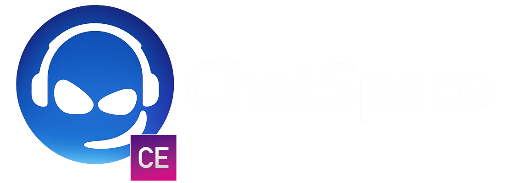
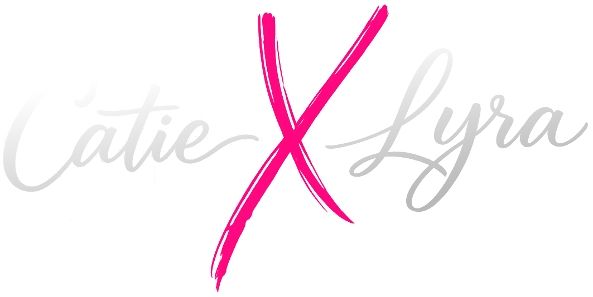

  

  <strong>Room-first community chat for small, expressive spaces.</strong>

<h1 align="center">Self-hosted room chat for expressive communities.</h1>

ChatSpace Community Edition gives communities self-hosted shared rooms with avatars on a live stage, real-time room chat, community-wide chat, private DMs, linked pairs, voice, webcams, games, uploads, reactions, and practical moderation tools.

  <strong>Created in collaboration with</strong>

  &nbsp;&nbsp;&nbsp;&nbsp;
  
  &nbsp;&nbsp;&nbsp;&nbsp;&nbsp;&nbsp;<strong>+</strong>&nbsp;&nbsp;&nbsp;&nbsp;&nbsp;&nbsp;
  
  &nbsp;&nbsp;&nbsp;&nbsp;&nbsp;&nbsp;&nbsp;&nbsp;&nbsp;&nbsp;

  
  &nbsp;&nbsp;
  
  &nbsp;&nbsp;
  
  &nbsp;&nbsp;
  
  &nbsp;&nbsp;
  
  &nbsp;&nbsp;
  

## What It Includes

- Live room stage with draggable avatars, profile images, webcams, typing indicators, speech balloons, and linked pairs.
- Room chat, Community Chat, private DMs, and linked-party private tabs.
- Room creation with image or video backgrounds, background upload progress, and owner/admin/developer room editing.
- Locate Friends with room navigation and DM actions.
- Games: Chess and Checkers.
- Voice chat, voice notes, file attachments, image/PDF/document uploads, reactions, edit/delete history, and moderator-visible deleted messages.
- Moderation tools for room owners, guides, developers, and admins, including warn, kick, room ejection lists, blocks, and community ejection for higher staff roles.
- Admin dashboard for users, roles, system limits, backups, restores, tool logs, and block/ejection cleanup.
- Setup flow with SQLite recommended and optional MySQL/MariaDB support.
- Designed for ordinary PHP hosting: Apache, NGINX, LiteSpeed, and PHP 8.x.

## Install

1. Upload and extract ChatSpace Community Edition.
2. Run Setup and select or configure your database.
3. Create the first admin account with an avatar, then enter the lobby and create the first room.

See [INSTALL.md](INSTALL.md) for PHP extension requirements, database options, and deployment notes.

## Project Promise

When Mark and Catie first started the web version of ChatSpace, the promise was simple: provide something people could download and install on even a cheap web host. If a host can run common PHP apps like WordPress or 4images, it should be in the right neighborhood for ChatSpace Community Edition.

That promise is being kept here.

## Authors

ChatSpace Community Edition is led by NeO/Mark from ChatSpace, working in collaboration with Catie Clark + Lyra AI.

See [AUTHORS.md](AUTHORS.md) for project credits.

## License

ChatSpace Community Edition is free to self-host, use, modify, and share under the project license. It may not be resold, repackaged as a paid product, offered as a hosted/managed service, or used to build a commercial competing product.

See [LICENSE.md](LICENSE.md).
